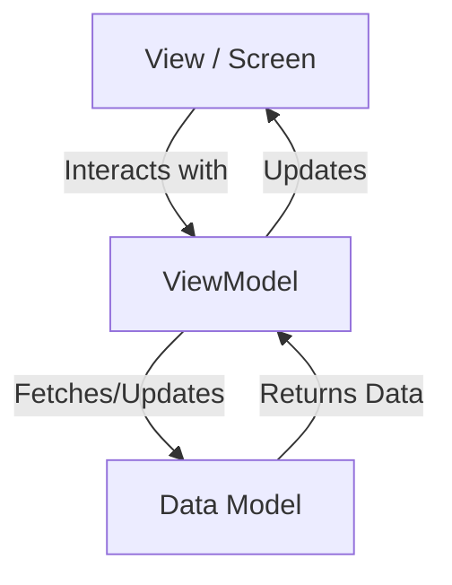

# Chop Chop 🍔 Delivery App

Chop Chop is a premium, feature-rich Flutter e-commerce application designed for seamless food ordering and delivery. Built with visual excellence and modern software architecture in mind, it provides a state-of-the-art user experience for food enthusiasts.

## ✨ Features

- **Dynamic Onboarding**: Engaging multi-step onboarding flow to introduce the app's core value.
- **Global Theme Switching**: Fully supports **Light Mode** and **Dark Mode** with a curated, harmonious color palette.
- **Smart Location Services**: Integrated map searching and geocoding using `flutter_map` and OpenStreetMap to accurately pin delivery addresses.
- **MVVM Architecture**: Clean separation of concerns between Views, ViewModels, and Models for maximum maintainability.
- **Advanced UI Components**: Premium glassmorphism effects, smooth micro-animations, and responsive layouts.
- **Food Discovery**:
  - Filterable search for restaurants and meal types.
  - Interactive restaurant details and food menu tiles.
  - Favorites management to save preferred eateries.
- **Comprehensive Checkout Flow**:
  - Itemized cart management.
  - Step-by-step order summary and checkout.
  - Multiple payment method support.
  - Real-time order tracking with driver info and status stepper.
- **Profile & Personalization**:
  - Edit Profile with dynamic avatar initials.
  - Saved addresses management.
  - Integrated FAQ and Support chat system.
  - Multi-language selection support.

## 🛠 Tech Stack

- **Framework**: [Flutter](https://flutter.dev/) (SDK >= 3.0.0)
- **State Management**: [Provider](https://pub.dev/packages/provider)
- **Maps & Geolocation**:
  - `flutter_map` & `latlong2`
  - `geolocator` & `geocoding`
- **Navigation**: Named routes with a centralized `AppRoutes` configuration.
- **Utilities**:
  - `shared_preferences` for local state persistence.
  - `intl` for formatting and localization.
  - `dio` & `http` for future API integrations.

## 🏗 Architecture

The project follows the **MVVM (Model-View-ViewModel)** design pattern:



- **Models**: Plain Dart classes representing data structures (e.g., `MenuItem`, `LanguageModel`).
- **ViewModels**: Logic layers that handle state using `ChangeNotifier` and communicate with views via the `Provider` package.
- **Views**: UI entry points (`lib/views`) that consume data from ViewModels and render widgets.

## 📁 Project Structure

```text
lib/
├── models/         # Data structures
├── routes/         # AppRoutes and navigation logic
├── services/       # Future API or local service logic
├── utils/          # AppTheme and global constants
├── viewmodels/     # Business logic and state management
├── views/          # Screen widgets
└── widgets/        # Reusable UI components
```

## 🚀 Getting Started

### Prerequisites

- Flutter SDK (>= 3.0.0)
- Android Studio / VS Code with Flutter extensions
- A mobile emulator or physical device

### Installation

1. **Clone the repository**:
   ```bash
   git clone https://github.com/your-username/chop-chop.git
   cd chop-chop
   ```

2. **Install dependencies**:
   ```bash
   flutter pub get
   ```

3. **Run the application**:
   ```bash
   flutter run
   ```

## 📄 License

This project is licensed under the MIT License - see the LICENSE file for details (if applicable).
